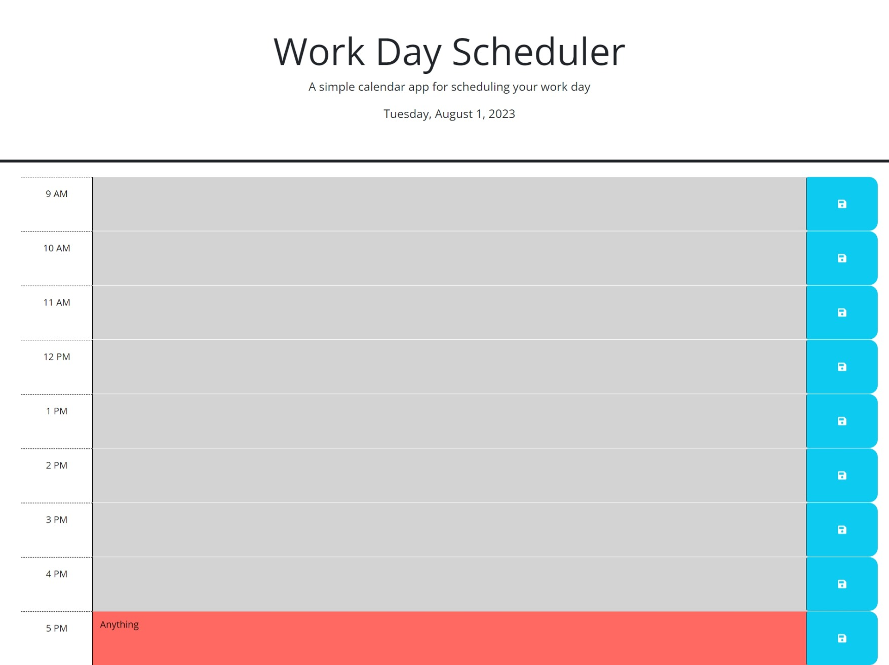

# Work Day Scheduler

## Description

Welcome to the Work Day Scheduler! This web application is designed to help you manage your workday more effectively by providing a simple calendar app for scheduling your tasks and events. The scheduler allows you to add important events for each hour of a typical working day (9 am – 5 pm) and saves them locally so you can access them later.

## Table of Contents

- [User Story](#user-story)
- [Acceptance Criteria](#acceptance-criteria)
- [Demo](#demo)
- [Deployment](#deployment)
- [Installation](#installation)
- [Usage](#usage)
- [Technologies Used](#technologies-used)
- [Features](#features)
- [Credits](#credits)
- [Contact](#contact)

## User Story

As an employee with a busy schedule, I want to add important events to a daily planner so that I can manage my time effectively.

## Acceptance Criteria

The Work Day Scheduler application should meet the following criteria:

1. When the user opens the scheduler, the current day is displayed at the top of the calendar.
2. The scheduler should present time blocks for standard business hours (9 am – 5 pm).
3. Each time block should be color-coded to indicate whether it is in the past, present, or future.
4. The user should be able to enter an event by clicking into a time block.
5. The user should be able to save the event by clicking the "Save" button for that time block.
6. Saved events should persist even after the page is refreshed.

## Demo

Here's a short demo showcasing the functionality of the Work Day Scheduler:

## Deployment

You can access the deployed version of the Work Day Scheduler at [URL](https://arsalanbardsiri.github.io/time-sensitive-scheduler/).

## Installation

To run the Work Day Scheduler locally, follow these steps:

1. Clone the repository: `git clone https://github.com/arsalanbardsiri/time-sensitive-scheduler.git`
2. Navigate to the project directory: `cd time-sensitive-scheduler`
3. Open the `index.html` file in your web browser.

## Usage

- Open the Work Day Scheduler in your web browser.
- The current day will be displayed at the top of the calendar.
- Scroll down to view time blocks for standard business hours (9 am – 5 pm).
- Each time block is color-coded to indicate whether it is in the past, present, or future.
- Click into a time block to enter an event for that hour.
- Click the "Save" button for that time block to save the event in local storage.
- The saved events persist even after you refresh the page.

## Technologies Used

The Work Day Scheduler application is built using the following technologies:

- HTML 
- CSS 
- JavaScript 
- [Bootstrap](https://getbootstrap.com/) - Front-end framework for responsive design
- [Font Awesome](https://fontawesome.com/) - Icons for save button
- [Google Fonts](https://fonts.google.com/) - Fonts for improved typography
- [jQuery](https://jquery.com/) - JavaScript library for DOM manipulation
- [Day.js](https://day.js.org/) - JavaScript library for working with date and time

## Features

- Time blocks for standard business hours with the option to add events.
- Color-coded time blocks based on the current time.
- Events are saved in local storage for persistence.

## Credits

- [Arsalan Bardsiri](https://github.com/arsalanbardsiri/) - Developer

## Contact

If you have any questions or feedback about the Work Day Scheduler, feel free to reach out:

- Email: arsalanbardsiri@gmail.com
- GitHub: [github.com/arsalanbardsiri](https://github.com/arsalanbardsiri/)

Thank you for using the Work Day Scheduler!
